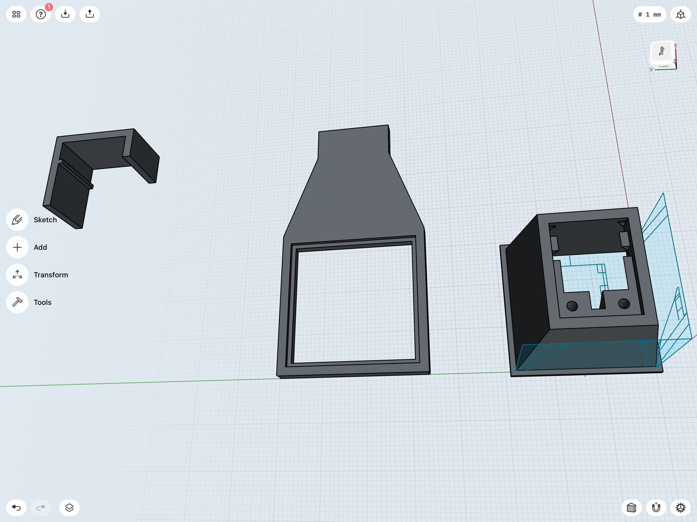
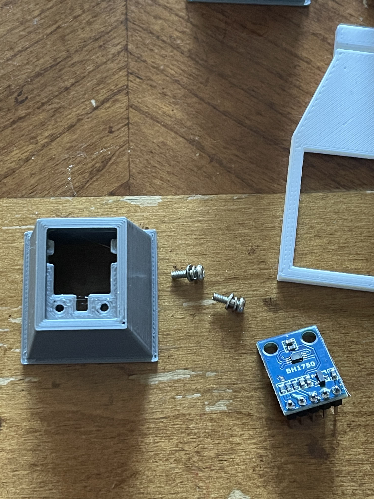
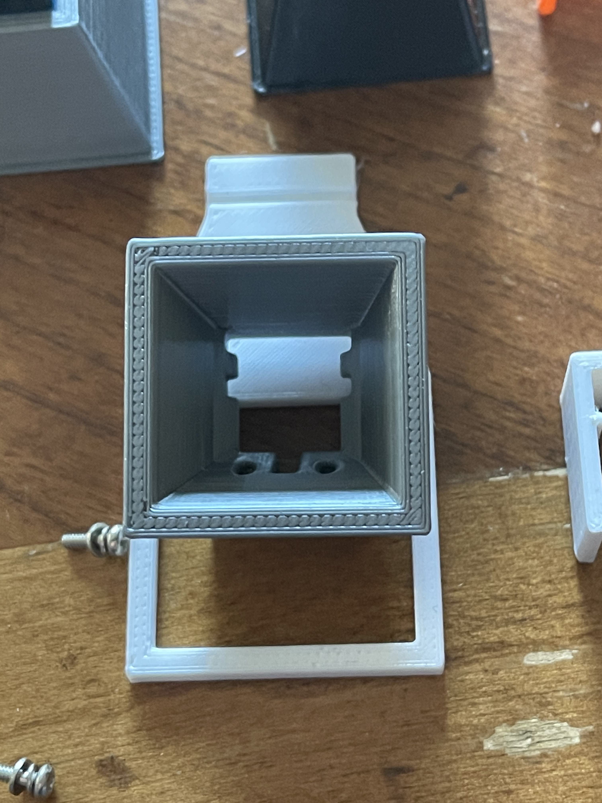
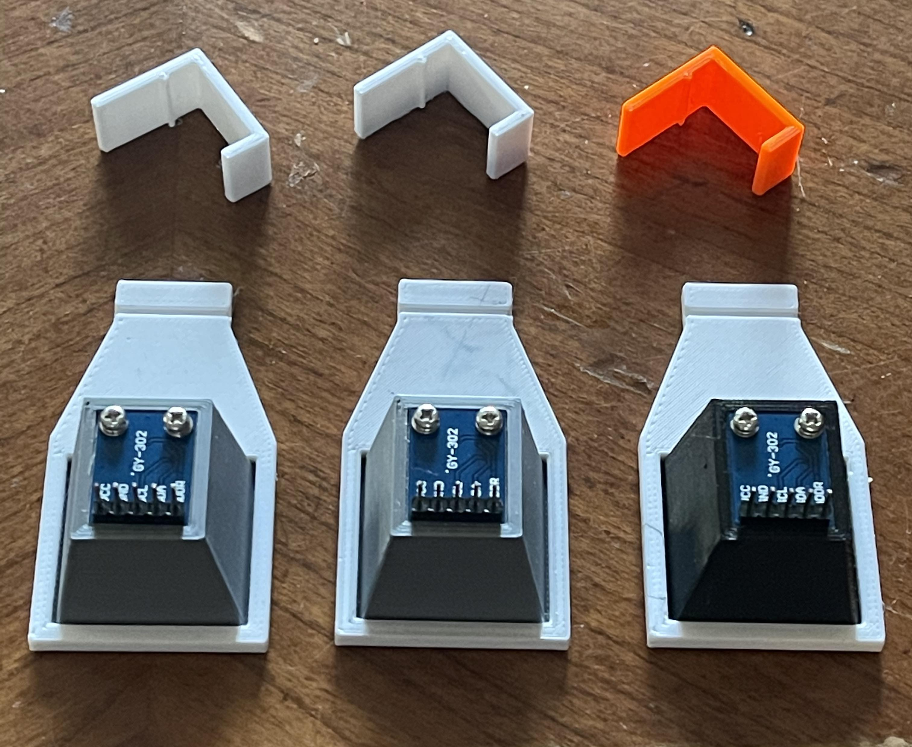
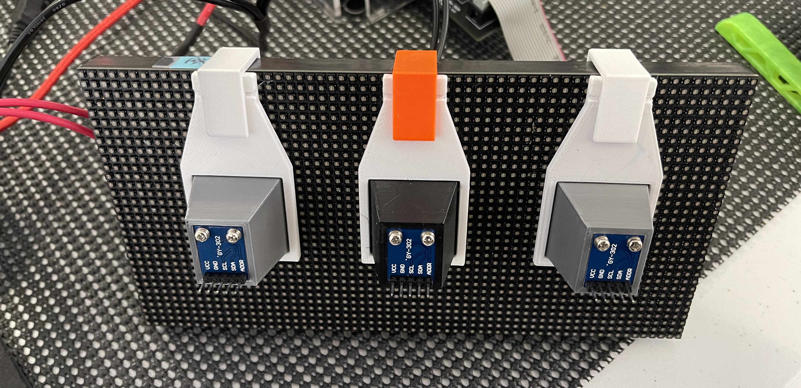

#  Instrumenting the HUB75 Matrix for measurement

Applying light sensors to our HUB75 Panels so we can directly measure emitted light.  

To recap:
The point of this project is to instrument our HUB75 panel with light sensors so we can directly measure the emitted light from our LEDs.  Our Goal is to identify 16 distinct grey scale values so we can imporove our color presentation of the panels.

We hypothesize that this will force us to move from a simple PWM to a more advanced PWM.

![Project Maintenance][maintenance-shield]

[![License][license-shield]](LICENSE) 

## The hardware

For this project we are using three BH1750 ambient light sensors. These are wired up to a common I2C bus and each BH1750 has its own device enable line.  We want to be able to measure the LED light output unaffected by ambient light aound our testbench so we build a shroud to block out room light from between the RGB Matrix panel and the BH1750 sensor.  We 3D printed the shroud parts and mounted the BH1750's to the new shrouds which are in-turn clipped to the Matrix Panels.

## The fixture design

**NOTE** the shroud opening is 24mm x 24mm to accommodate P2 (2mm), P3 (3mm), and P4 (4mm) distances between LEDs (as well as other multiples).

The shroud features M2 screw holes and voids where R,C parts interfere witht he PCB supports.

## The fixture with BH1750 installed

The three shrouds are assembled.

...And then clipped onto the panel, now ready for the wiring harness.

---

> If you like my work and/or this has helped you in some way then feel free to help me out for a couple of :coffee:'s or :pizza: slices! 
> 
>  &nbsp;&nbsp; -OR- &nbsp;&nbsp; [Patreon.com/IronSheep](https://www.patreon.com/IronSheep?fan_landing=true)

---

## License

Licensed under the MIT License.  
 
Follow these links for more information:

### [Copyright](copyright) | [License](LICENSE)

[maintenance-shield]: https://img.shields.io/badge/maintainer-stephen%40ironsheep%2ebiz-blue.svg?style=for-the-badge

[marketplace-version]: https://vsmarketplacebadge.apphb.com/version-short/ironsheepproductionsllc.spin2.svg

[marketplace-installs]: https://vsmarketplacebadge.apphb.com/installs-short/ironsheepproductionsllc.spin2.svg

[marketplace-rating]: https://vsmarketplacebadge.apphb.com/rating-short/ironsheepproductionsllc.spin2.svg

[license-shield]: https://img.shields.io/badge/License-MIT-yellow.svg
