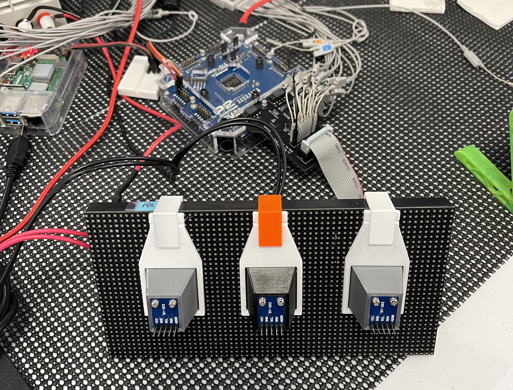

# P2-Panel-Light-Measure
Using BH1750s to measure HUB75 Panel output - running on the Parallax P2 Processor

![Project Maintenance][maintenance-shield]

[![License][license-shield]](LICENSE) 

The point of this project is to instrument our HUB75 panel with light sensors so we can directly measure the emitted light from our LEDs.  Our Goal is to identify 16 distinct grey scale values so we can imporove our color presentation of the panels.

We hypothesize that this will force us to move from a simple PWM to a more advanced PWM.

All of the driving of the panel, the measuring of the light values and reporting will take place on the Propeller 2 development hardware.

**Fig 1 - Our panel waiting for wiring harness**

See also [Fixture Mechanical Design](Mechanism.md)

## The project

---

> If you like my work and/or this has helped you in some way then feel free to help me out for a couple of :coffee:'s or :pizza: slices! 
> 
> &nbsp;&nbsp; -OR- &nbsp;&nbsp; [Patreon.com/IronSheep](https://www.patreon.com/IronSheep?fan_landing=true)

---

## License

Licensed under the MIT License.  
 
Follow these links for more information:

### [Copyright](copyright) | [License](LICENSE)

[maintenance-shield]: https://img.shields.io/badge/maintainer-stephen%40ironsheep%2ebiz-blue.svg?style=for-the-badge

[marketplace-version]: https://vsmarketplacebadge.apphb.com/version-short/ironsheepproductionsllc.spin2.svg

[marketplace-installs]: https://vsmarketplacebadge.apphb.com/installs-short/ironsheepproductionsllc.spin2.svg

[marketplace-rating]: https://vsmarketplacebadge.apphb.com/rating-short/ironsheepproductionsllc.spin2.svg

[license-shield]: https://img.shields.io/badge/License-MIT-yellow.svg
